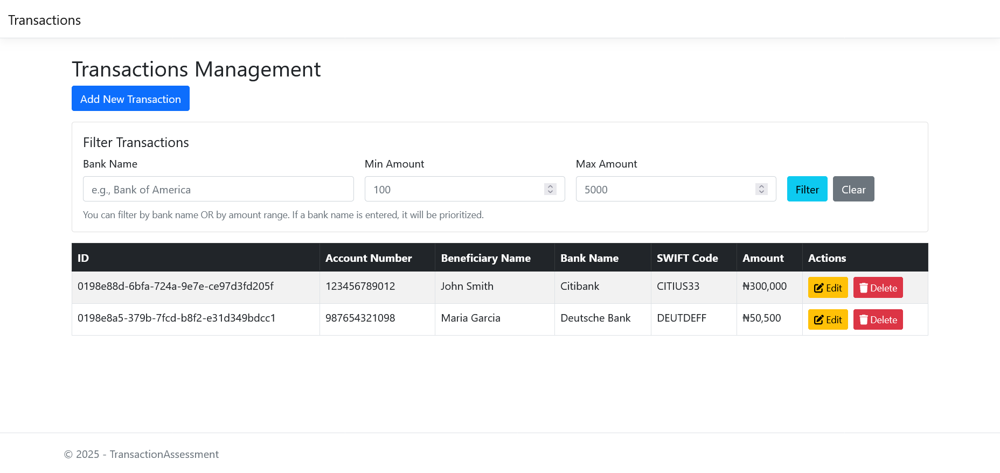

# Transaction Management System

A full-stack web application for performing CRUD (Create, Read, Update, Delete) operations on financial transactions. Built with ASP.NET Core MVC, Entity Framework Core, and jQuery, this project demonstrates a clean, modern architecture suitable for scalable web applications. The application is containerized with Docker and deployed on Render.

**Live Demo:** [https://transaction-app-tdpk.onrender.com](https://transaction-app-tdpk.onrender.com) 



---

## Features

-   **Full CRUD Functionality:** Create, read, update, and delete transactions seamlessly without page reloads.
-   **Dynamic Frontend:** A responsive user interface powered by jQuery and AJAX for a smooth single-page feel.
-   **Server-Side Validation:** Robust validation to ensure data integrity.
-   **Advanced Filtering:**
    -   Filter transactions by bank name using a case-insensitive, partial match search.
    -   Filter transactions by a minimum and maximum amount range.
-   **Containerized & Cloud-Ready:** Fully containerized with Docker for consistent environments and easy deployment.
-   **Automated Database Migrations:** The database schema is automatically created and updated on application startup.

---

## Technical Stack & Architecture

### Backend
-   **Framework:** ASP.NET Core 8 MVC
-   **Database:** PostgreSQL
-   **ORM:** Entity Framework Core 8
-   **Architecture:**
    -   **Repository Pattern:** Decouples the business logic from the data access layer for better maintainability and testing.
    -   **Dependency Injection:** Used throughout the application to manage dependencies and promote loose coupling.
-   **Tooling:**
    -   **AutoMapper:** For clean and automated object-to-object mapping.
    -   **ILogger:** Structured logging for effective monitoring and debugging.

### Frontend
-   **Framework:** Bootstrap 5
-   **JavaScript:** jQuery for DOM manipulation and AJAX calls.
-   **Views:** Razor Pages (`.cshtml`)

### Deployment
-   **Containerization:** Docker
-   **Platform:** Render (Web Service + PostgreSQL Database)
-   **CI/CD:** Deployed via Git push from the main branch.

---

## Key Architectural Decisions

-   **Repository Pattern:** Chosen to abstract the data layer, making it easy to switch data sources (e.g., from SQL Server to PostgreSQL) without affecting the application's core logic. The use of a generic `IRepository<T>` ensures reusable code for common data operations.
-   **ViewModel Pattern:** `TransactionViewModel` is used to separate the concerns of the data model (`Transaction.cs`) from the view. This allows for tailored validation and prevents over-posting vulnerabilities.
-   **AJAX-Powered Frontend:** All data manipulations are handled via AJAX calls to the backend API. This provides a faster, more responsive user experience compared to traditional full-page reloads.
-   **Containerization with Docker:** The `Dockerfile` creates a portable, self-contained environment, ensuring that the application runs identically on a developer's machine and in production on Render.
-   **Persisted Data Protection Keys:** To solve antiforgery token decryption errors in a containerized environment, Data Protection keys are persisted to the PostgreSQL database, ensuring all application instances share a consistent key ring.

---

## Getting Started Locally

### Prerequisites

-   [.NET 8 SDK](https://dotnet.microsoft.com/download/dotnet/8.0)
-   [PostgreSQL](https://www.postgresql.org/download/)
-   A code editor like [Visual Studio](https://visualstudio.microsoft.com/)

### 1. Clone the Repository

```bash
git clone https://github.com/Floren-teena/ApTech_Transaction_Assessment.git
cd ApTech_Transaction_Assessment
```

### 2. Configure the Database Connection

1. Open appsettings.json.

2. Update the DefaultConnection string to point to your local PostgreSQL instance.

```json
{
  "ConnectionStrings": {
    "DefaultConnection": "Host=localhost;Database=TransactionDB;Username=postgres;Password=your_password"
  }
}
```

### 3. Apply Migrations

Run the following command in your terminal to create the database and its schema:

```bash
dotnet ef database update
```

### 4. Run the Application

```bash
dotnet run
```

The application will be available at https://localhost:7XXX or http://localhost:5XXX.


## Deployment

This application is configured for deployment on Render.

1. Push the code to a GitHub repository.

2. Create a PostgreSQL service on Render.

3. Create a Web Service on Render, connecting it to the Git repository and selecting the Docker runtime.

4. Add an environment variable with the key ConnectionStrings__DefaultConnection and paste the database's internal connection string as the value.

The application will automatically run database migrations on startup.

  

  